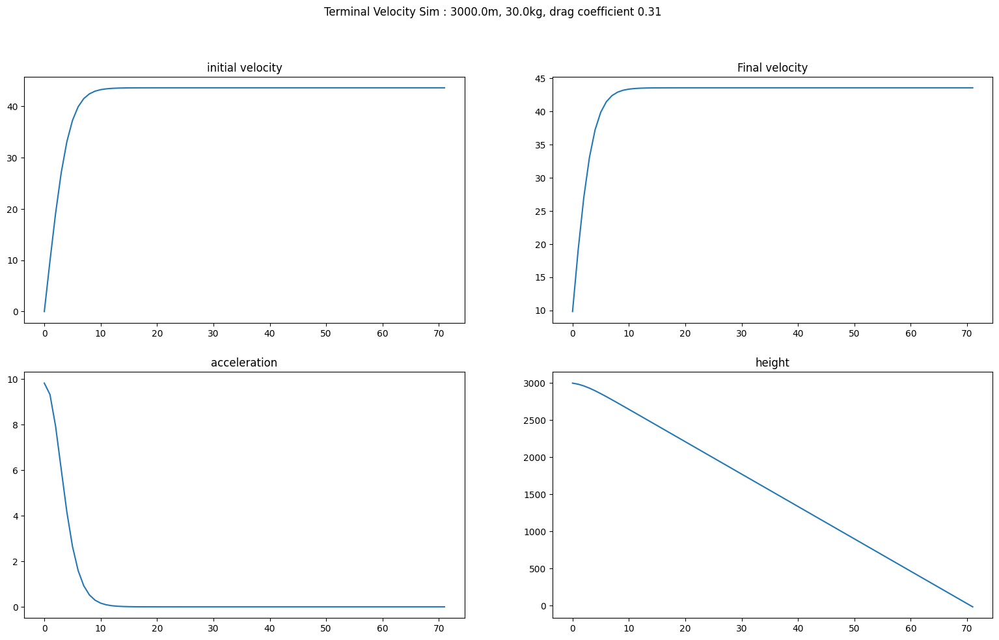

# Terminal Velocity Simulator
## Instructions

```
usage: tv.py [-h] --height HEIGHT --mass MASS --drag_co DRAG_CO [--g G] [--time TIME] [--para PARA] [--out OUT]

Terminal Velocity Simulator

required arguments:
  --height HEIGHT
  --mass MASS
  --drag_co DRAG_CO

optional arguments:
  -h, --help
  --g G
  --time TIME
  --para PARA
  --out OUT
```
## Parameters
*height* -> Falling height in metres (m).

*mass* -> Mass of falling object (kg).

*drag_co* -> Drag coefficient of object. A lower drag coefficient will lead to a greater terminal velocity.

*g* -> acceleration due to gravity. Change this to simulate other planets.

*time* -> sampling rate of simulation. A smaller time step gives a more accurate representation of the simulation but the simulation will take longer to execute.

*para* -> Used to simulate a parachute being opened at a specific height.

*out* -> File name of image to save. If not specified, will only show plot.

## Expected Output

